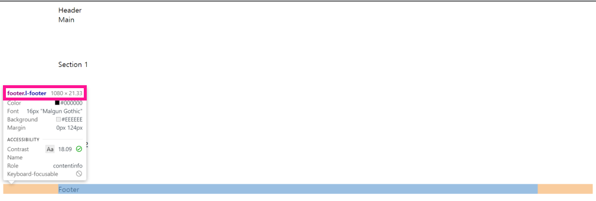
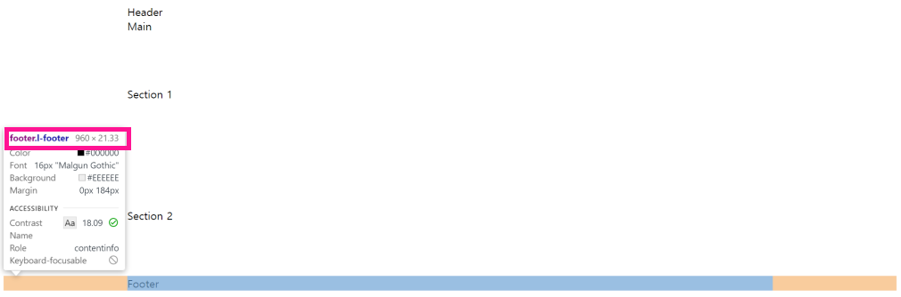
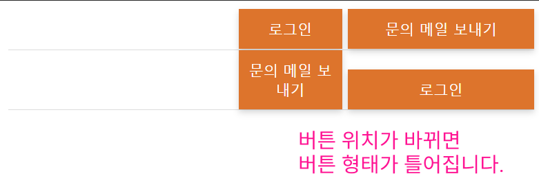
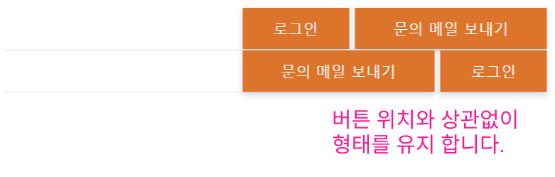
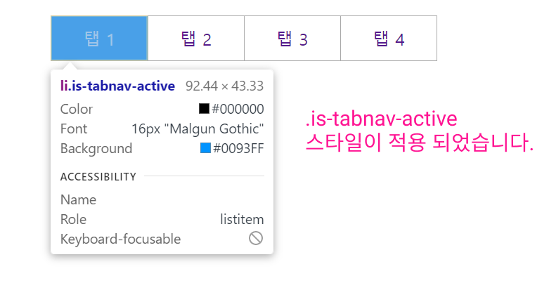
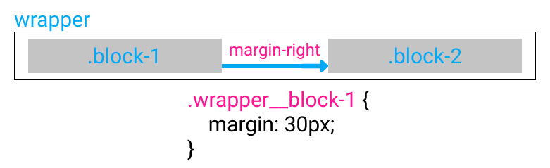

##### top
# Charter 03. 다양한 설계 기법

설계 기법의 종류는 다음과 같습니다.

* OOCSS
* SMACSS
* BEM
* PRECSS

<br/>

## OOCSS

``OOCSS (Object Oriented CSS)``는 객체지향 프로그래밍과 같은 맥락을 CSS에 도입한 방식 입니다.

``OOCSS``의 주된 관심사는 객체 단위인 ``모듈``의 조합으로 스타일링 하는 것입니다.

따라서 ``OOCSS`` 설계기법을 반영하기 위해서는 다음과 같은 사고가 필요합니다.

* ``구조``와 ``스킨``의 분리
* ``컨테이너``와 ``콘텐츠``의 분리

<br/>

### ``구조``와 ``스킨``의 구분

구조는 공통적인 스타일이라고 이해할 수 있습니다.

예를 들면, 현재 프로젝트에서 사용하는 ``btn_xxxx`` 스타일 클래스를 가지는 버튼의 공통된 스타일을 ``구조``로써 만듭니다.

그리고 ``버튼 배경색``, ``버튼 글자색`` 등 사용처에 따라 조금씩 달라지는 부분을 ``스킨``으로 만듭니다.

즉, ``요소의 공통 스타일`` 과 ``Modifier`` 로 만드는 방식 입니다.

<br/>

다음은 ``구조``와 ``스킨``으로 분리한 OOCSS 기법을 반영한 버튼 스타일 입니다.

```html
<main id="main">
  <button class="btn general">기본 버튼</button>
  <button class="btn cancel">취소 버튼</button>
</main>
```

```css
#main .btn {
  display: inline-block;

  width: 300px;
  min-width: 100%;

  padding: 10px 20px;

  box-shadow: 0 3px 6px rgba(0, 0, 0, 0.16);

  font-size: 18px;
  text-align: center;
  line-height: 1.5;
}

#main .general {
  color: #fff;
  background-color: #e25c00;
}

#main .cancel {
  color: #222;
  background-color: #f1de00;
}
```

<br/>

### ``컨테이너``와 ``콘텐츠``의 분리

위의 예시의 ``btn`` 스타일 클래스는 ``#main`` 이라는 모듈 내부에서만 동작 합니다.

이러한 경우, ``콘텐츠``인 ``btn`` 스타일 클래스는 ``컨테이너``에 의존하는 상태인 것입니다.

즉, ``컨테이너``와 ``콘텐츠``가 분리되지 않은 상태입니다.

이를 해소하기 위해, ``#main`` 이라는 선택자를 사용하지 않으면, 프로젝트 전체에서 ``btn`` 관련 스타일 클래스를 자유롭게 재사용할 수 있게 됩니다.

<br/>

다음은 ``컨테이너``와 ``콘텐츠``의 분리에 대한 OOCSS 기법을 반영시킨 형태 입니다.

```html
<main id="main">
  <button class="btn general">기본 버튼</button>
  <button class="btn cancel">취소 버튼</button>
</main>
```

```css
.btn {
  display: inline-block;
  
  width: 300px;
  max-width: 100%;

  padding: 10px 20px;

  box-shadow: 0 3px 6px rgba(0, 0, 0, 0.16);

  font-size: 18px;
  text-align: center;
  line-height: 1.5;
}

.general {
  color: #fff;
  background-color: #e25c00;
}

.cancel {
  color: #222;
  background-color: #f1de00;
}
```

<br/>

위의 예시로 작성한 버튼의 스타일을 비교해 보면 확장도 용이하며, 가독성 또한 좋다는 것을 알 수 있습니다.


<br/><br/>


## SMACSS

``SMACSS``는 ``OOCSS``를 좀 더 확장한 형식의 설계기법 입니다.

``SMACSS``에서 CSS를 분류하는 방법으로는 다음과 같습니다.

1. 베이스 (Base)
2. 레이아웃 (Layout)
3. 모듈 (Module)
4. 스테이트 (State)
5. 테마 (Theme)

<br/>

### 베이스 (Base) 규칙

``베이스 (Base)``는 프로젝트 전체에 대한 표준 스타일을 정의하는 영역 입니다.

프로젝트 전체 표준 스타일 이므로, ``Reset CSS``의 역할을 하는 부분으로 이해할 수 있습니다.

따라서 특정 상황에 대한 스타일이 아닌, 표준 스타일로써 작성해야 합니다.

<br/>

``베이스 (Base)`` 규칙을 적용한 예로는 다음과 같습니다.

```css
body {
  background-color: #fff;
}

a > img {
  transition: 0.25s;
}

ul li {
  margin-bottom: 10px;
}

a:hover {
  text-decoration: underline;
}
```

<br/>

### 레이아웃 (Layout) 규칙

``레이아웃 (Layout)``은 ``헤더``, ``메인``, ``푸터`` 등 과 같이 프로젝트의 큰 틀을 구성하는 ``큰 모듈``에 대한 규칙(스타일) 입니다.

``ID 선택자``는 ``지나친 상세도``의 문제가 있지만, ``레이아웃 (Layout)`` 에서는 사용을 허용 합니다.

하지만, 스타일의 일관성을 위해, ``l-`` 형식의 접두사를 사용한 ``스타일 클래스``를 사용하는 것이 더 좋다고 생각 합니다.

<br/>

``레이아웃 (Layout)`` 규칙에 대한 예는 다음과 같습니다.

```html
<body>
  <header class="l-header">
    Header
  </header>
  
  <main class="l-main">
    Main

    <section class="l-section">
      Section 1
    </section>

    <section class="l-section">
      Section 1
    </section>
  </main>

  <footer class="l-footer">
    Footer
  </footer>
</body>
```

```css
.l-header {
  width: 1080px;

  margin-right: auto;
  margin-left: auto;

  background-color: #fff;
}

.l-main {
  width: 1080px;

  margin-right: auto;
  margin-left: auto;

  background-color: #fff;
}

.l-footer {
  width: 1080px;

  margin-right: auto;
  margin-left: auto;

  background-color: #fff;
}

.l-section {
  padding-top: 80px;
  padding-bottom: 80px;
}
```



<br/>

만약, 기존의 ``레이아웃 (Layout)``에서 ``좁은 형태``의 스타일이 필요하다면, 기존의 스타일을 ``손자 선택자``로써 스타일을 ``덮어쓰는`` 방식으로 설계할 수 있습니다.

```html
<!-- 기존의 Layout 스타일을 손자 선택자로 사용하기 위한 선행 Class 사용 -->
<body class="l-narrow">
  <!-- 이하 동일 -->
  <header class="l-header">
    Header
  </header>
  
  <main class="l-main">
    Main

    <section class="l-section">
      Section 1
    </section>

    <section class="l-section">
      Section 1
    </section>
  </main>

  <footer class="l-footer">
    Footer
  </footer>
</body>
```

```css
.l-header {
  width: 1080px;

  margin-right: auto;
  margin-left: auto;

  background-color: #fff;
}

.l-main {
  width: 1080px;

  margin-right: auto;
  margin-left: auto;

  background-color: #fff;
}

.l-footer {
  width: 1080px;

  margin-right: auto;
  margin-left: auto;

  background-color: #fff;
}

.l-section {
  padding-top: 80px;
  padding-bottom: 80px;
}

/* 조상 Class를 사용한, 손자 클래스 Overriding */
.l-narrow .l-header {
  width: 960px;
}

.l-narrow .l-main {
  width: 960px;
}

.l-narrow .l-footer {
  width: 960px;
}
```



<br/>

### 모듈 (Module) 규칙

여기서 ``모듈 (Module)``이란, ``레이아웃 (Layout) 안에 배치되는 것``을 전제로 합니다.

즉, ``레이아웃 (Layout)`` 안에 배치할 수 있는 개별 모듈을 모두 ``모듈 (Module)``로써 설계 합니다.

* 타이틀
* 버튼
* 카드
* 리스트
* 메뉴

다시말해, ``모듈 (Module)``로써 분류된 스타일은 레이아웃이 달라져도 형태가 유지되어야만 합니다.

이러한 조건을 만족하기 위해서는 다음 사항을 준수해야 합니다.

* 서로 다른 레이아웃에서도 형태를 유지 하는가?
* 불필요한 코드는 없는가?
* 요소형 셀렉터를 사용하지 않는다.
* 특정 콘텍스트에 의존하지 않는다.

<br/>

위의 조건 중, ``특정 콘텍스트에 의존``하는 방식으로 스타일을 작성하면 다음과 같은 문제가 발생합니다.

* 버튼 문자열이 짧은 버튼: ``width: 80px`` 로 설정
* 버튼 문자열이 긴 버튼: 버튼 ``width: 160px`` 로 설정
* 두 버튼의 위치 변경 시, 버튼의 형태가 유지되지 않는 현상 발생

```html
<body>
  <!-- 원래의 스타일대로 출력 -->
  <header class="l-header">
    <a href="#" class="btn">로그인</a>
    <a href="#" class="btn">문의 메일 보내기</a>
  </header>
    
  <!-- 두 버튼의 위치를 바꾸면.. 형태가 틀어짐 -->
  <header class="l-header">
    <a href="#" class="btn">문의 메일 보내기</a>
    <a href="#" class="btn">로그인</a>
  </header>
</body>
```

```css
@charset "UTF-8";

.l-header {
  max-width: 1230px;

  margin-right: auto;
  margin-left: auto;

  border-bottom: 1px solid #ddd;

  text-align: right;
}

.btn {
  display: inline-block;

  width: 300px;
  max-width: 100%;

  padding: 20px 10px;

  color: #fff;
  font-size: 18px;
  text-align: center;
  text-decoration: none;

  background-color: #dd742c;
  box-shadow: 0 3px 6px rgba(0, 0, 0, 0.16);

  border-width: 0;


  transition: all 0.25s;
}

/* 문제의 스타일 - 버튼 위치에 대한 스타일 */
.l-header .btn {
  width: 80px;

  padding-top: 10px;
  padding-bottom: 10px;

  font-size: 14px;
}

/* 문제의 스타일 - 버튼 위치에 대한 스타일 */
.l-header .btn:nth-of-type(2) {
  width: 160px;
}
```



<br/>

위의 예시에서 처럼 ``콘텍스트``에 의존하는 방식으로 작성한 스타일은 형태가 틀어지는 문제가 발생합니다.

이를 ``서브 클래스 (Sub Class)``를 사용하여 수정하면 다음과 같습니다.

```html
  <!-- 원래의 스타일대로 출력 -->
  <header class="l-header">
    <a href="#" class="btn btn-small">로그인</a>
    <a href="#" class="btn btn-small btn-long">문의 메일 보내기</a>
  </header>
    
  <!-- 두 버튼의 위치를 바꿔도, 형태 유지 -->
  <header class="l-header">
    <a href="#" class="btn btn-small btn-long">문의 메일 보내기</a>
    <a href="#" class="btn btn-small">로그인</a>
  </header>
</body>
```

```css
@charset "UTF-8";

.l-header {
  max-width: 1230px;

  margin-right: auto;
  margin-left: auto;

  border-bottom: 1px solid #ddd;

  text-align: right;
}

.btn {
  display: inline-block;

  width: 300px;
  max-width: 100%;

  padding: 20px 10px;

  color: #fff;
  font-size: 18px;
  text-align: center;
  text-decoration: none;

  background-color: #dd742c;
  box-shadow: 0 3px 6px rgba(0, 0, 0, 0.16);

  border-width: 0;


  transition: all 0.25s;
}

/* 서브 클래스로 정의 */
/* 콘텍스트의 위치에 상관없이, class에 따라 스타일 적용 */
.btn.btn-small {
  width: 80px;

  padding-top: 10px;
  padding-bottom: 10px;

  font-size: 14px;
}

/* 서브 클래스로 정의 */
/* 콘텍스트의 위치에 상관없이, class에 따라 스타일 적용 */
.btn.btn-long {
  width: 160px;
}
```



<br/>

### 스테이트 (State) 규칙

``스테이트 (State)`` 규칙은 기존 스타일을 ``덮어쓰거나 확장하기 위해`` 사용합니다.

``모듈 (Module)``의 ``서브 클래스 (Sub Class)``와 차이점은 다음과 같습니다.

* ``레이아웃``, ``모듈`` 둘 다에 사용 가능 합니다.
* ``자바스크립트``에 의해 할당 / 해제 됩니다. (자바스크립트에 의존)
* 접두사로 ``is-``를 사용하여, 상태값에 대한 스타일임을 나타냅니다.
* ``특정 모듈``에 대해서만 사용하도록 명시적 ``모듈명``을 표시 합니다.

아래 코드는 탭을 구현한 것으로, ``click`` 이벤트가 발생할 경우 Javascript에 의해 ``스테이트 (State)``가 적용되는 예시 입니다.

```html
<ul class="tabnav">
  <li class="is-tabnav-active">
    <a href="#">
      탭 1
    </a>
  </li>

  <li>
    <a href="#">
      탭 2
    </a>
  </li>

  <li>
    <a href="#">
      탭 3
    </a>
  </li>

  <li>
    <a href="#">
      탭 4
    </a>
  </li>
</ul>
```  

```css
@charset "UTF-8";

.tabnav {
  display: flex;
}

.tabnav > li {
  list-style-type: none;

  border-top: 1px solid #aaa;
  border-right: 1px solid #aaa;
  border-bottom: 1px solid #aaa;
}

.tabnav > li:first-child {
  border-left: 1px solid #aaa;
}

.tabnav > li > a {
  display: block;
  padding: 10px 30px;
  text-decoration: none;
}

/* 활성화 스테이트 (State) 스타일 */
.is-tabnav-active {
  background-color: #0093ff;
}

.is-tabnav-active > a {
  /* click 이벤트 발생 무시 */
  pointer-events: none;
  color: #fff;
}
```

``스테이트 (State)`` 규칙은 ``is-tabnav-active``가 핵심 입니다.



<br/>

### 태마 (Theme) 규칙

기존의 스타일을 일정한 규칙에 따라 ``덮어쓰는 것`` 으로, 사이트의 태마에 사용 됩니다.

규모가 큰 태마의 경우에는, 접두사로 ``theme-``을 붙이는 것을 권장 합니다.

```css
/* light 태마 */
/* light.css */

.module {
  background-color: #f7f7f7;
}
```

```css
/* dark 태마 */
/* dark.css */
.module {
  background-color: #333;
}
```


<br/><br/>


## BEM

``BEM``이란, 모듈을 다음 3가지 단위로 분해하여 정의하는 설계 기법 입니다.

* B: ``Blobk``
* E: ``Element``
* M: ``Modifier``

``BEM``을 정의하면 다음과 같습니다.

> 클래스 셀렉터를 사용하고, 상세도를 균일하게 유지하는 방식 입니다.
>
> 클래스명은 ``소문자``만 사용하며, 단어는 ``하이폰(-)``으로 연결 합니다.

<br/>

### Block

BEM에서 ``Block``은 ``특정 콘텍스트에 의존하지 않고, 어디서나 재사용 가능한 모듈``을 말합니다.

간단한 예로 다음과 같이 클래스 작명을 합니다.

```css
.global-menu {
  /* 메뉴 모듈 클래스 */
}

.footer {
  /* 푸터 모듈 클래스 */
}
```

또한 클래스명에는 상태가 아닌 ``의미``를 가지도록 만들어야 합니다.

의미를 가지는 클래스명이란 다음과 같습니다.

```css
.red-text {
  /* BEM에 맞지 않는 클래스명 */
  /* 의미가 아닌, ``빨간색 텍스트``라는 상태를 나타내고 있습니다 */
}

.error {
  /* BEM 스타일의 클래스명 */
  /* ``에러``라는 의미를 나타내고 있습니다. */
}
```

<br/>

### Element

``Element``는 ``Block``을 구성하는 ``선택적 요소``이며, ``Block 밖``에서는 ``단독으로 사용할 수 없는`` 모듈 입니다.

``Element``의 특징은 다음과 같습니다.

* ``Element``는 ``Block``을 구성하는 하위 모듈 입니다.
* ``Element``는 반드시 ``Block`` 안에 위치해야 합니다.
* ``클래스 명``은 ``Block명``을 ``상속받고``, ``언더스코어 2개(__)``뒤에 ``Element명``이 와야 합니다.
* ``Element 명`` 역시 ``의미``를 가지는 이름으로 만들어야 합니다.
* ``Block``에 ``Element``가 없는 경우도 허용합니다.

```css
.menu__item
```

* Element 안에 ``중첩된 Element``는 허용하지 않습니다.

<br/>

### Modifier

``Modifier``는 ``Block``또는 ``Element``의 모습, 상태, 움직임을 정의하는 모듈 입니다.

``Modifier``의 특징은 다음과 같습니다.

* ``Modifier`` 반드시 ``Block`` 또는 ``Element`` 클래스가 있는 상태에서 ``두번째 클래스``로 사용해야 하니다.

```css
.btn {
  /* "Block" 모듈 */
}

.btn_sizze_s {
  /* .btn "Block"에 대한 "Modifier"
}
```

```html
<!-- Modifier로 "btn_size_s"를 사용 하였습니다 -->
<button class="btn btn_size_s">
  버튼
</button>
```

* ``Modifier 명``은 ``Block`` 또는 ``Element``명을 상속받고, ``언더스코어(_) 하나``로 연결 합니다.
* ``Modifier 명``은 ``키와 값``으로 만들어 지는데, 복수의 단어는 ``하이폰(-)``으로 연결하고, ``키와 값``은 ``언더스코어(_)``로 연결 합니다.
* ``Modifier 명``은 ``Boolean`` 형식과 ``키-값`` 형식으로 만들 수 있습니다.
    * ``Boolean`` 타입: ``disabled``, ``actived``, ``focused`` 등...
    * ``키-값`` 타입: ``theme_dark``, ``color-theme_caution`` 등...

```css
.global-nav__link-item_color-theme_caution {
  /*
  global-nav: "Block" 명
  link-item: "Element" 명
  color-theme: "Modifier" 키
  caution: "Modifier" 값
  */
}
```

* 여러개의 ``Modifier``를 복수로 사용할 수 있습니다.

```css
.btn {
  /* btn Block */
}

.btn_color-theme_dark {
  /* btn Block 의 color-theme이 dark인 Modifier
}

.btn_size_s {
  /* btn Block 의 버튼 크기가 s인 Modifier */
}
```

```html
<button class="btn btn_color-theme_dark btn_size_s">
  버튼
</button>
```

* 같은 스타일을 ``덮어쓰는 Modifier``는 ``복수로 사용할 수 없습니다``

```
.btn {
    /* btn Block */
}

.btn_size_s {
    /* btn Block의 버튼 크기가 s인 Modifier */
}

.btn_size_m {
    /* btn Block의 버튼 크기가 m인 Modifier */
}
```

```html
<!-- btn_sizes 와 btn_size_m은 버튼 크기에 대한 같은 스타일이므로, 잘못된 사용 -->
<button class="btn btn_size_s btn_size_m">
  버튼
</button>
```

* 하나의 ``Modifier``는 ``단일 책임 원칙``을 준수해야 합니다. (다른 ``Modifier``와 충돌 가능성 때문)

<br/>

### Mix

``BEM``에 대한 처음 소개에서 ``레이아웃 (Layout)``관련 스타일은 하지 않는다고 하였습니다.

그렇다면, ``margin`` 같은 ``레이아웃`` 관련 스타일은 별도로 만들어야 합니다.

그래서 ``레이아웃 (Layout)`` 스타일은 ``Mix``를 사용하여 스타일링 합니다.



```css
.block-1 {
  /* block-1 Block의 스타일 */
}

.block-2 {
  /* block-2 Block의 스타일 */
}

.wrapper__block-1 {
  /* .wrapper Block내의 block-1 Block의 Mix 스타일 */
  margin-right: 20px;
}
```

```html
<div class="wrapper">
  <!-- wrapper__block-1 Mix 사용 -->
  <div class="block-1 wrapper__block-1">
    Block-1
  </div>
  
  <div class="block-2">
    Block-2
  </div>
</div>
```

<br/>

### BEM 네이밍 규칙

BEM은 이름규칙을 변형하여 사용하는 방법도 가능 합니다.

여러가지 네이밍 규칙 중, 가장 마음에 드는 규칙은 ``리액트 스타일`` 이었습니다.

* ``Block``, ``Element``는 ``어퍼 캐멀 케이스``로 작성
* ``Modifier``는 ``로우 캐멀 케이스``로 작성
* ``Block``과 ``Element``의 구분은 ``하이폰(-) 하나``로 사용
* ``Modifier``의 시작은 ``언더스코어(_) 하나``로 사용
* ``Modifier``의 ``키와 값`` 구분은 ``하이폰(-) 하나``로 사용

```css
.Menu-Item_actived {
  /*
  Block: "Menu"
  Element: "Item"
  Modifier: "actived"
  */
}
```