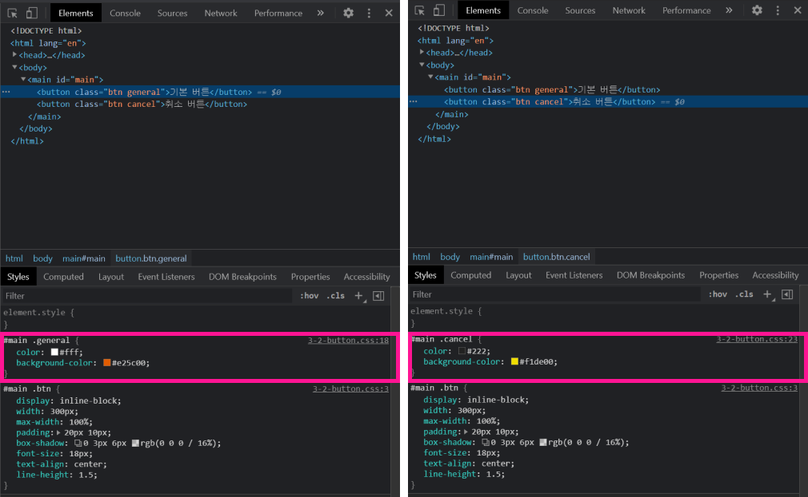

##### top
# Charter 03. 다양한 설계 기법

설계 기법의 종류는 다음과 같습니다.

* OOCSS
* SMACSS
* BEM
* PRECSS

<br/>

## OOCSS

``OOCSS (Object Oriented CSS)``는 객체지향 프로그래밍과 같은 맥락을 CSS에 도입한 방식 입니다.

``OOCSS``의 주된 관심사는 객체 단위인 ``모듈``의 조합으로 스타일링 하는 것입니다.

따라서 ``OOCSS`` 설계기법을 반영하기 위해서는 다음과 같은 사고가 필요합니다.

* ``구조``와 ``스킨``의 분리
* ``컨테이너``와 ``콘텐츠``의 분리

<br/>

### ``구조``와 ``스킨``의 구분

구조는 공통적인 스타일이라고 이해할 수 있습니다.

예를 들면, 현재 프로젝트에서 사용하는 ``btn_xxxx`` 스타일 클래스를 가지는 버튼의 공통된 스타일을 ``구조``로써 만듭니다.

그리고 ``버튼 배경색``, ``버튼 글자색`` 등 사용처에 따라 조금씩 달라지는 부분을 ``스킨``으로 만듭니다.

즉, ``요소의 공통 스타일`` 과 ``Modifire`` 로 만드는 방식 입니다.

<br/>

다음은 ``구조``와 ``스킨``으로 분리한 OOCSS 기법을 반영한 버튼 스타일 입니다.

```html
<main id="main">
  <button class="btn general">기본 버튼</button>
  <button class="btn cancel">취소 버튼</button>
</main>
```

```css
#main .btn {
  display: inline-block;

  width: 300px;
  min-width: 100%;

  padding: 10px 20px;

  box-shadow: 0 3px 6px rgba(0, 0, 0, 0.16);

  font-size: 18px;
  text-align: center;
  line-height: 1.5;
}

#main .general {
  color: #fff;
  background-color: #e25c00;
}

#main .cancel {
  color: #222;
  background-color: #f1de00;
}
```

<br/>

### ``컨테이너``와 ``콘텐츠``의 분리

위의 예시의 ``btn`` 스타일 클래스는 ``#main`` 이라는 모듈 내부에서만 동작 합니다.

이러한 경우, ``콘텐츠``인 ``btn`` 스타일 클래스는 ``컨테이너``에 의존하는 상태인 것입니다.

즉, ``컨테이너``와 ``콘텐츠``가 분리되지 않은 상태입니다.

이를 해소하기 위해, ``#main`` 이라는 선택자를 사용하지 않으면, 프로젝트 전체에서 ``btn`` 관련 스타일 클래스를 자유롭게 재사용할 수 있게 됩니다.

<br/>

다음은 ``컨테이너``와 ``콘텐츠``의 분리에 대한 OOCSS 기법을 반영시킨 형태 입니다.

```html
<main id="main">
  <button class="btn general">기본 버튼</button>
  <button class="btn cancel">취소 버튼</button>
</main>
```

```css
.btn {
  display: inline-block;
  
  width: 300px;
  max-width: 100%;

  padding: 10px 20px;

  box-shadow: 0 3px 6px rgba(0, 0, 0, 0.16);

  font-size: 18px;
  text-align: center;
  line-height: 1.5;
}

.general {
  color: #fff;
  background-color: #e25c00;
}

.cancel {
  color: #222;
  background-color: #f1de00;
}
```

<br/>

위의 예시로 작성한 버튼의 스타일을 비교해 보면 확장도 용이하며, 가독성 또한 좋다는 것을 알 수 있습니다.

